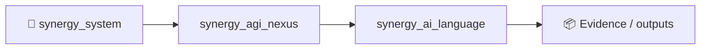

# AI Language Pro

[](https://pypi.org/project/ai-language-pro/)
[](https://pypi.org/project/ai-language-pro/)
[](https://github.com/Shtenco/ai_language/actions/workflows/ci.yml)

AI Language Pro is a Python package for repository-aware coding with explicit semantic traceability. It combines three layers:

1. **`ail` — a repository-aware coding agent** that can inspect a local project, edit files, run controlled commands, and iterate through multi-step coding tasks using the OpenAI Responses API.
2. **Semantic task and repository graphs** that normalize requirements into stable `REQ-*` identifiers, index Python files/symbols/imports/calls/tests, and record which requirements caused each mutation or validation command.
3. **AI Language compiler — an experimental instruction compiler** that parses a small `.ailang` format into an intermediate semantic graph, an AST, and simple target-language output.

Starting with `0.5.x`, the semantic graph is part of the coding-agent execution path rather than a separate demonstration. Each task can produce a machine-readable trace containing the intent graph, repository graph, change graph, impact graph, requirement coverage, and unresolved requirements. The `.ailang` compiler remains an experimental research component rather than a production general-purpose compiler.

The package is implemented in Python and does not require Node.js or npm.

## Contents

- [Requirements](#requirements)
- [Installation](#installation)
- [Quick start](#quick-start)
- [Coding agent](#coding-agent)
  - [Execution model](#execution-model)
  - [Semantic traceability](#semantic-traceability)
  - [Available tools](#available-tools)
  - [Interactive mode](#interactive-mode)
  - [One-shot mode](#one-shot-mode)
  - [CLI reference](#cli-reference)
  - [Approval modes](#approval-modes)
  - [Security model](#security-model)
  - [Data and privacy considerations](#data-and-privacy-considerations)
- [AI Language compiler](#ai-language-compiler)
  - [Language format](#language-format)
  - [Compilation pipeline](#compilation-pipeline)
  - [Compiler CLI](#compiler-cli)
- [Python API](#python-api)
- [Project layout](#project-layout)
- [Development](#development)
- [Testing and CI](#testing-and-ci)
- [Packaging and releases](#packaging-and-releases)
- [Current limitations](#current-limitations)
- [License](#license)
- [Support](#support)

## Requirements

- Python **3.10 or newer**
- an OpenAI API key for `ail`, `ai-language agent`, and `ai-language ask`
- a local directory that will be used as the agent workspace

Supported Python versions declared by the package are 3.10, 3.11, 3.12, and 3.13.

The compiler-only API does not require an API key.

## Installation

### Recommended: pipx

For command-line use, `pipx` keeps the package isolated from the rest of the Python environment:

```bash
pipx install ai-language-pro
```

Upgrade an existing installation with:

```bash
pipx upgrade ai-language-pro
```

### pip

```bash
python -m pip install ai-language-pro
```

### Development checkout

```bash
git clone https://github.com/Shtenco/ai_language.git
cd ai_language
python -m venv .venv
```

Linux/macOS:

```bash
source .venv/bin/activate
python -m pip install -e ".[dev]"
```

Windows PowerShell:

```powershell
.\.venv\Scripts\Activate.ps1
python -m pip install -e ".[dev]"
```

## Quick start

Set the API key in the environment:

Linux/macOS:

```bash
export OPENAI_API_KEY="sk-..."
```

Windows PowerShell:

```powershell
$env:OPENAI_API_KEY="sk-..."
```

Then enter the repository you want the agent to work on:

```bash
cd /path/to/project
ail
```

A one-shot task can be sent directly from the shell:

```bash
ail "Find the failing tests, identify the root cause, fix the implementation, and run the relevant tests again."
```

For analysis without file changes or command execution:

```bash
ail --read-only "Review the architecture and identify the highest-risk technical debt."
```

The longer equivalent command is:

```bash
ai-language agent "Review this repository"
```

## Coding agent

`ail` is a local tool runner around a remote model. The model does not receive unrestricted filesystem or shell access. Instead, it can request a fixed set of functions exposed by the `Workspace` class.

The workspace defaults to the current directory and can be changed with `--cwd`.

### Execution model

A task follows this loop:

```text
user request
    |
    v
CodingAgent
    |
    v
OpenAI Responses API
    |
    | function call
    v
Workspace tool dispatcher
    |
    +-- list/read/search files
    +-- write/replace/delete files
    +-- run a controlled command
    +-- inspect git status/diff
    |
    v
tool result
    |
    v
Responses API
    |
    +-- another tool call
    |        or
    +-- final response
```

The agent continues this cycle until the model returns a final response or the configured tool-round limit is reached.

In interactive mode, the previous Responses API response ID is retained so follow-up prompts continue the same conversation. `/clear` resets that conversation state.

### Semantic traceability

Before the first model call for a task, the agent builds a deterministic semantic task model. Natural-language clauses become stable requirement identifiers such as `REQ-1`, `REQ-2`, and `REQ-3`. Requirements are classified as actions, constraints, or validation requirements.

For Python repositories, the repository graph performs bounded best-effort AST analysis and can include file, class, function, method, test, module-import, and call relationships. The graph is built from files visible through the workspace; secret-like paths remain excluded.

Mutating tools (`write_file`, `replace_in_file`, `delete_file`) and validation commands (`run_command`) must carry the `requirement_ids` that justify the action. The resulting trace can therefore derive four related views:

```text
IntentGraph        requirement structure
RepositoryGraph    files, Python symbols, imports and calls
ChangeGraph        requirement -> tool event -> target
ImpactGraph        changed files -> defined symbols -> affected tests
```

Requirement coverage distinguishes `implemented`, `addressed`, `verified`, and `unresolved` states instead of treating any model response as proof that the task is complete. Validation requirements are only considered verified after a successful mapped `run_command` event.

The JSON trace schema for this release is `ai-language.semantic-trace/v2`. It intentionally stores event metadata and short result summaries, not file contents, replacement text, API keys, or credential material.

Interactive inspection:

```text
/trace
/coverage
```

One-shot export suitable for CI artifacts:

```bash
ail -y --trace-out build/ail-trace.json --show-coverage \
  "Implement the change and run the relevant tests"
```

For workflows that want an explicit gate, `--fail-unresolved` returns exit code `3` when the derived trace still contains unresolved requirements. This is an opt-in policy because review/audit prompts may intentionally perform no mutations.

### Available tools

| Tool | Purpose | Mutating |
| --- | --- | --- |
| `list_files` | Recursively list workspace files with depth limits | No |
| `read_file` | Read a text file with line numbers | No |
| `search_text` | Case-insensitive text search across the workspace | No |
| `write_file` | Create or fully rewrite a text file | Yes |
| `replace_in_file` | Perform an exact text replacement | Yes |
| `delete_file` | Delete one regular file | Yes |
| `run_command` | Execute one direct local command | Potentially |
| `git_diff` | Show `git status --short` and `git diff` | No |

Tool output is capped before it is returned to the model. Large files and very large search result sets are also bounded to prevent accidental context explosion.

### Interactive mode

Start the agent without a prompt:

```bash
ail
```

Example session:

```text
AI Language Agent | model=gpt-5.6 | workspace=/work/project
Commands: /help, /clear, /diff, /trace, /coverage, /exit
ail> inspect the parser and explain why malformed input is accepted
```

Interactive commands:

| Command | Action |
| --- | --- |
| `/help` | Show the built-in command summary |
| `/clear` | Reset model conversation context |
| `/diff` | Display local Git status and unstaged diff |
| `/trace` | Show the latest requirement-to-action semantic trace |
| `/coverage` | Show requirement implementation/verification coverage |
| `/exit` | Exit the session |
| `/quit` | Alias for `/exit` |

### One-shot mode

Use one-shot mode for scripts, CI experiments, or a single bounded task:

```bash
ail "Run the relevant tests and explain the failure"
```

A task that is allowed to modify files still uses the approval policy described below.

Export the latest trace and print coverage:

```bash
ail -y --trace-out build/trace.json --show-coverage \
  "Refactor the parser and run the relevant tests"
```

Fail a CI step when semantic requirements remain unresolved:

```bash
ail -y --fail-unresolved --trace-out build/trace.json \
  "Apply the requested change and validate it"
```

### CLI reference

The short executable and the explicit subcommand are equivalent:

```text
ail [PROMPT] [OPTIONS]
ai-language agent [PROMPT] [OPTIONS]
```

Agent options:

| Option | Default | Description |
| --- | --- | --- |
| `--cwd PATH` | `.` | Workspace root exposed through agent tools |
| `--api-key KEY` | environment | Explicit API key; environment variable is preferred |
| `--model MODEL` | `gpt-5.6` | Model passed to the Responses API |
| `--reasoning LEVEL` | `high` | Reasoning effort for compatible GPT-5.6 models |
| `--max-steps N` | `30` | Maximum number of tool-call rounds for one task |
| `-y`, `--yes` | off | Automatically approve allowed local mutations and command execution |
| `--read-only` | off | Disable write/delete/replace and command execution |
| `--quiet-tools` | off | Suppress tool progress messages on stderr |
| `--trace-out FILE` | none | Write the latest `semantic-trace/v2` JSON after a completed task |
| `--show-coverage` | off | Print requirement coverage after a completed task |
| `--fail-unresolved` | off | In one-shot mode return exit code 3 when requirements remain unresolved |

Accepted reasoning values are:

```text
none, low, medium, high, xhigh, max
```

The exact model capabilities associated with these values are determined by the selected API model. AI Language Pro only forwards the configured value when using a compatible model family.

### API key resolution

The package resolves the API key in this order:

1. explicit `--api-key` argument;
2. `OPENAI_API_KEY` from the process environment;
3. `OPENAI_API_KEY` loaded from a local `.env` file by `python-dotenv`.

The `.env` file may be used by the application to load configuration, but it is treated as secret-like content and is not exposed through agent file-reading tools.

### Approval modes

By default, file mutations and command execution require terminal confirmation.

Example:

```text
Approve replace_in_file: src/parser.py? [y/N]
```

For unattended local changes:

```bash
ail -y "Refactor the parser, update tests, and run pytest"
```

`-y` skips interactive approval. It does **not** disable the workspace path checks, secret-file filtering, command filtering, or Git restrictions.

For analysis-only use:

```bash
ail --read-only "Audit this repository for correctness and maintainability issues"
```

In read-only mode, mutating tools and `run_command` are rejected.

### Security model

The agent contains application-level safeguards intended to reduce accidental access and destructive operations.

#### Workspace confinement

All file paths are resolved relative to the configured workspace. A resolved path that escapes the workspace is rejected.

For example, an agent running with:

```bash
ail --cwd /work/project
```

cannot use the file tools to read `../other-project/secret.txt`.

#### Secret-like paths

The file tools hide or reject common credential locations and file names, including:

```text
.env
.env.*
.npmrc
.pypirc
credentials
credentials.json
secrets.json
.ssh/
.aws/
.azure/
.gnupg/
*.pem
*.key
```

This is a defensive filter, not a complete secret scanner. Credentials stored under arbitrary names are not guaranteed to be detected.

#### Command restrictions

`run_command` executes a parsed argument vector directly; it does not invoke a shell for normal command execution.

The current implementation rejects shell operators such as:

```text
&&  ||  ;  |  >  <  `  $(
```

It also blocks a set of privileged, destructive, or shell-launching executables, including commands such as `sudo`, `su`, `rm`, `dd`, `mkfs`, `bash`, `sh`, PowerShell, and `cmd.exe`.

Inline `python -c` execution is blocked. Repository scripts and modules can still be executed as normal files/modules when the executable itself is allowed.

For Git, the agent permits read-oriented subcommands such as:

```text
git status
git diff
git grep
git log
git show
git rev-parse
git ls-files
```

Mutating Git subcommands are rejected by the tool layer.

Before launching a command, environment variables whose names contain common credential markers such as `KEY`, `TOKEN`, `SECRET`, `PASSWORD`, or `CREDENTIAL` are removed from the child-process environment.

#### This is not an OS sandbox

The safeguards above are implemented in Python application code. They are **not** a replacement for process isolation, containers, virtual machines, mandatory access controls, or a dedicated low-privilege operating-system account.

An allowed executable can still have side effects. `-y` should therefore be used only in a workspace where autonomous changes are acceptable.

For higher-risk repositories, run the agent inside a disposable container or VM and expose only the required working directory.

### Data and privacy considerations

The model API is remote. When the agent calls `read_file`, `search_text`, command execution, or another tool, the resulting text can be returned to the model as tool output so it can continue the task.

This means selected source code, diagnostics, test output, and other workspace content may be transmitted to the configured API provider as part of model requests.

Do not use the agent on repositories containing data that your security, contractual, or regulatory requirements do not permit you to send to that provider.

The local secret-file filters reduce accidental exposure but are not a substitute for repository hygiene or a formal data-loss-prevention system.

## AI Language compiler

The second component is a deterministic prototype compiler for a small line-oriented instruction format.

It does not require an LLM to parse or compile `.ailang` source. The compiler implementation is conventional Python code that builds intermediate representations and dispatches to a target backend.

### Language format

Each non-empty, non-comment line has the following form:

```text
ACTION TARGET | constraint1; constraint2
```

The constraint section is optional.

Example:

```text
# payment_service.ailang
generate payment_service | retries; idempotency
validate contracts
emit docs | concise
```

Parsing rules in the current implementation:

- blank lines are ignored;
- lines beginning with `#` are ignored;
- the first token is normalized to lowercase and stored as the action;
- the remainder before `|` is stored as the target;
- constraints after `|` are separated by semicolons;
- every executable line must contain both an action and a target.

### Compilation pipeline

The current compiler pipeline is:

```text
.ailang source
    |
    v
parse_instructions()
    |
    v
list[Instruction]
    |
    +-------------------+
    |                   |
    v                   v
SemanticGraph        ProgramAST
                        |
                        v
                  target backend
                        |
                        v
                 generated source
```

`compile_source()` returns a `PipelineResult` containing:

- parsed instructions;
- semantic graph;
- AST;
- generated source code.

The semantic graph currently contains a root program node, instruction nodes, constraint nodes, `contains` edges, and `constrained_by` edges.

### Target backends

The current target set is:

```text
python
c
rust
solidity
kotlin
```

These backends are intentionally small prototypes. They demonstrate the intermediate representation and dispatch architecture; they do **not** attempt to synthesize complete production implementations from arbitrary natural-language requirements.

### Compiler CLI

Generate source code:

```bash
ai-language generate examples/service.ailang \
  --target python \
  --out build/service.py
```

Generate code and export the semantic graph:

```bash
ai-language generate examples/service.ailang \
  --target rust \
  --out build/service.rs \
  --emit-graph build/service.graph.json
```

Validate generated Python through bytecode compilation:

```bash
ai-language check build/service.py
```

Compile and execute a Python file:

```bash
ai-language run build/service.py
```

Send a single prompt directly to the configured model runtime:

```bash
ai-language ask "Review this API design"
```

`ask` is a simple one-request model interface. It is separate from the repository-aware agent loop.

## Python API

### Compiler

```python
from ai_language import compile_source

result = compile_source(
    """
    generate payment_service | retries; idempotency
    validate contracts
    """,
    target="rust",
)

print(result.instructions)
print(result.semantic_graph)
print(result.ast)
print(result.code)
```

### Coding agent

```python
from pathlib import Path

from ai_language import CodingAgent, Workspace

workspace = Workspace(
    root=Path.cwd(),
    read_only=True,
)

agent = CodingAgent(
    workspace=workspace,
    model="gpt-5.6",
    reasoning_effort="high",
    max_steps=20,
)

report = agent.run("Review the repository architecture")
print(report)
print(agent.trace_text())
print(agent.trace_json())
if agent.last_trace is not None:
    print(agent.last_trace.render_coverage_text())
```

For a write-capable integration, provide an approval callback or explicitly enable `auto_approve`:

```python
workspace = Workspace(
    root=Path.cwd(),
    auto_approve=True,
)
```

Treat `auto_approve=True` with the same care as CLI `-y`.

## Project layout

```text
ai_language/
├── .github/
│   └── workflows/
├── examples/
├── src/
│   └── ai_language/
│       ├── agent.py       # CodingAgent, Workspace, tools, safety checks
│       ├── cli.py         # ai-language and ail command-line interfaces
│       ├── client.py      # Simple Responses API client
│       ├── compiler.py    # Python validation/execution helpers
│       ├── config.py      # API key and default model configuration
│       ├── semantic_trace.py # Requirement, repository, change, impact, coverage graphs
│       ├── ir.py          # Instruction, graph, and AST data structures
│       └── pipeline.py    # Parser, IR construction, target code generators
├── tests/
├── LICENSE
├── README.md
└── pyproject.toml
```

## Development

Create an isolated environment and install development dependencies:

```bash
python -m venv .venv
source .venv/bin/activate
python -m pip install -e ".[dev]"
```

Run linting:

```bash
ruff check .
```

Run tests:

```bash
pytest
```

Build wheel and source distribution:

```bash
python -m build
```

The development dependency group currently includes `build`, `pytest`, `pytest-cov`, and `ruff`.

## Testing and CI

The repository uses GitHub Actions for continuous integration. The CI workflow installs the package with development dependencies, runs Ruff, and executes the test suite.

The tests cover the compiler/CLI path as well as important agent behavior, including workspace confinement, secret-file filtering, read-only restrictions, and the model/tool-call loop.

A passing CI build should be treated as the minimum requirement before merging changes to the agent runtime or packaging configuration.

## Packaging and releases

Package name on PyPI:

```text
ai-language-pro
```

Installed console entry points:

```text
ail
ai-language-agent
ai-language
```

The project uses a `src/` package layout and `setuptools.build_meta` as the build backend.

PyPI publication is configured through GitHub Actions Trusted Publishing (OIDC). The release workflow builds both a wheel and source distribution and publishes without storing a long-lived PyPI upload token in the repository.

Release metadata is defined in `pyproject.toml`. A release should update the package version there before publication.

## Current limitations

AI Language Pro is beta software. Important limitations in the current implementation include:

- The agent uses a remote model API and is not an offline coding assistant.
- Workspace restrictions are application-level checks, not an operating-system sandbox.
- The secret filter is name/path based and cannot detect every possible credential.
- `run_command` blocks a defined set of dangerous patterns but cannot prove that every allowed executable is side-effect free.
- There is no transactional filesystem layer or automatic rollback after edits.
- File editing is based on full-file writes and exact text replacement rather than a structured patch engine.
- Interactive conversation state is maintained through the model API response chain; there is no independent persistent project-memory database.
- Python symbol/import/call indexing is bounded best-effort static analysis; dynamic dispatch, runtime imports, generated code, and cross-language symbol resolution are not fully modeled.
- Requirement extraction is deterministic and intentionally lightweight; complex specifications may need a future richer planning/IR layer.
- Requirement coverage is provenance-based evidence, not a formal proof of semantic correctness.
- Tool output is intentionally truncated at bounded sizes.
- The `.ailang` compiler grammar and target generators are prototypes and are not production language backends.
- Generated code should be reviewed and tested before use.

These constraints are deliberate to keep the current implementation small enough to inspect, test, and evolve without presenting prototype behavior as a stronger guarantee than the code actually provides.

## License

This repository is distributed under the **AI Language Pro Commercial License v1.0**. See [LICENSE](LICENSE) for the complete terms.

Commercial use requires a separate written agreement as specified by the license.

## Support

Repository:

- https://github.com/Shtenco/ai_language

Issues:

- https://github.com/Shtenco/ai_language/issues

PyPI:

- https://pypi.org/project/ai-language-pro/

If you want to support continued development:

- ETH: `0x980Ddb04c54979b3Ed23df4a7DBc7049b7d0D686`
- BTC: `bc1q49rfm0p6qh6nlnm4az4yhhk9x82zfxwgtcnhvm`


<!-- SYNERGY-FEDERATION-PASSPORT:START -->
---

## 🧭 SYNERGY federation passport

**Домен:** 🧠 Semantic / language layer  
**Архитектурный родитель:** [`synergy_agi_nexus`](https://github.com/Shtenco/synergy_agi_nexus)  
**Архитектурный корень:** [`synergy_system`](https://github.com/Shtenco/synergy_system)



Эта диаграмма фиксирует место в документационной федерации. Реальная code/runtime dependency должна подтверждаться отдельными артефактами.

### Навигация

- [📚 Атлас всех 75 репозиториев](https://github.com/Shtenco/synergy_system/blob/main/docs/SYNERGY_REPOSITORY_ATLAS.md)
- [🧾 Машиночитаемый registry](https://github.com/Shtenco/synergy_system/blob/main/registry/SYNERGY_REPOSITORIES.json)
- [🧭 SYNERGY SYSTEM](https://github.com/Shtenco/synergy_system)

### Evidence rule

`GREEN` присваивается только воспроизводимым утверждениям. Исследовательский код, диаграмма или заявленная метрика без проверяемого artifact trail остаются `R&D/CANDIDATE`.

<!-- SYNERGY-FEDERATION-PASSPORT:END -->